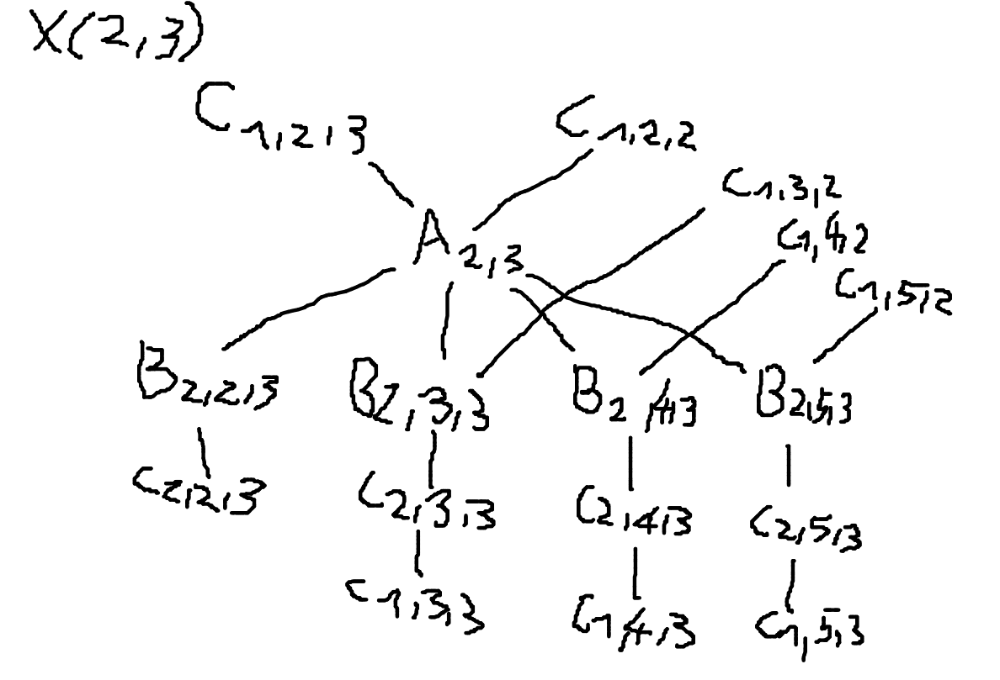
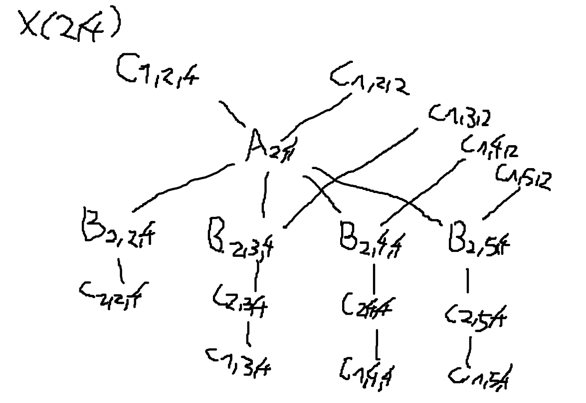
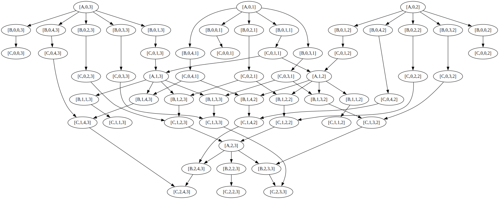

# Współbieżna eliminacja Gaussa

## Wstęp teoretyczny

Eliminacja Gaussa służy do obliczania układów równań liniowych postaci $M \times x = y$.
Układ równań można przedstawić jako:


Dla wygody obliczeń, algorytm może potraktować macierz M i wektor y jako całość:


Algorytm korzysta z 3 elementarnych, niepodzielnych operacji:
```py
def A(i, k):
    """ znalezienie mnożnika dla wiersza i, do odejmowania go od k-tego wiersza """
    m[k][i] = M[k][i] / M[i][i]
    
def B(i, j, k):
    """ pomnożenie j-tego elementu wiersza i przez mnożnik - do odejmowania od k-tego wiersza """
    n[i][j][k] = M[i][j] * m[k][i]

def C(i, j, k):
    """ odjęcie j-tego elementu wiersza i od wiersza k """
    M[k][j] = M[k][j] - n[i][j][k]
```

Sam algorytm ma postać:

```py
for i in range(N-1):
    for k in range(i+1, N):
        A(i, k)
        for j in range(i, N+1):
            B(i, j, k)
            C(i, j, k)
```

Po każdej operacji A(i, k) następuje ciąg operacji:
B(i, i, k), C(i, i, k), B(i, i+1, k), C(i, i+1, k), ..., B(i, N, k), C(i, N, k)

Gdyby pominąć operacje B i C, algorytm miałby postać:
A(0, 1), A(0, 2), ..., A(0, N-1), ..., A(1, 2), A(1, 3),...A(1, N-1),..., ...,A(N-3, N-2), A(N-3, N-1), A(N-2, N-1)

Wszystkie wyznaczone przez algorytm operacje składają się na alfabet w sensie teorii śladów.
W dodatku, gdyby przedstawić je w kolejności takiej jak wykonywane są przez pseudokod powyżej, powstały ciąg symboli
alfabetu byłby algorytmem w sensie teorii śladów.

Taki ciąg miałby postać:
A(0,1), B(0, 0, 1), C(0, 0, 1), ...,B(0, N, 1), C(0, N, 1),...,A(0, N-1), B(0, 0, N-1), C(0, 0, N-1), ... B(0, N, N-1),
C(0, N, N-1),..., A(N-2, N-1), B(N-2, N-2, N-1), C(N-2, N-2, N-1), B(N-2, N-1, N-1), C(N-2, N-1, N-1), B(N-2, N, N-1),
C(N-2, N, N-1).

Dla dowolnej pary (i, k) takiej, że A(i, k) należy do alfabetu, definiuje się podzbiór relacji zależności X(i, k):

X(i, k) = sym({(A(i,k), C(i-1,i,k)), (A(i,k), C(i-1,i,i)), (B(i, i, k), A(i, k)), (B(i, i+1, k), A(i, k)), ...,
(B(i,N,k), A(i,k)), (B(i,i+1,k), C(i-1,i+1,i)), (B(i,i+2,k), C(i-1,i+2,i)), ..., (B(i,N,k), C(i-1,N,i)),
(C(i,i,k), (B(i,i,k)), (C(i,i+1,k), B(i,i+1,k)), ..., (C(i,N,k), B(i,N,k)), (C(i,i+1,k), C(i-1,i+1,k)),
(C(i,i+2,k), C(i-1,i+2,k)), ..., (C(i,N,k), C(i-1,N,k))})

Relacja zależności D to suma wszystkich istniejących X(i, k).

Sposób budowania X(2, 3) i X(2, 4) dla N=5 przedstawiono na wykresach poniżej:





Przykładowy graf zależności Diekerta, dla N=4, wygenerowany za pomocą programu graphviz:



Postać normalna Foaty dla dowolnego N ma postać:

FNF = (A(0, 1),...,A(0,N-1))
(B(0,0,1),...,B(0,N,1),...,B(0,0,N-1),...,B(0,N,N-1))
(C(0,0,1),...,C(0,N,1),...,C(0,0,N-1),...,C(0,N,N-1))
((A(1, 2),...,A(1,N-1)))
(B(1,1,2),...,B(1,N,2),...,B(1,1,N-1),...,B(1,N,N-1))
(C(1,1,2),...,C(1,N,2),...,C(1,1,N-1),...,C(1,N,N-1))
...
(A(N-2,N-1))
(B(N-2,N-2,N-1), B(N-2,N-1,N-1), B(N-2,N,N-1))
(C(N-2,N-2,N-1), C(N-2,N-1,N-1), C(N-2,N,N-1))


## Implementacja - wstęp
W projekcie wykorzystano język C++ w wersji 20, a także bibliotekę CUDA w wersji 20. Żeby skompilować program na Linuxie,
będąc w katalogu głównym projektu należy wykonać polecenia:

```bash
mkdir build
cmake -B./build -S.
cd build
make
```

Kompilacja może okazać się niemożliwa bez biblioteki `nvidia-cuda-toolkit`, no i oczywiście bez posiadanej biblioteki
CUDA w odpowiedniej wersji.

Żeby go wykonać, wystarczy w katalogu build wykonać polecenie `./gauss`.

Dane wejściowe należy umieścić w pliku `input.txt` w katalogu głównym projektu. Po wykonaniu programu, w katalogu
pojawią się pliki wyjściowe:
- `output-foata.txt` - rozwiązanie układu otrzymane metodą korzystającą z FNF
- `output-gaussian.txt` - rozwiązanie układu otrzymane metodą uproszczoną
- `graph.dot` - graf Diekerta wygenerowany przez metodę FNF, możliwy do zwizualizowania za pomocą programu Graphviz.

Na Windowsie/MacOS polecenia powinny być analogiczne, ale na tych systemach programu nie przetestowano.

## Implementacja - algorytm korzystający z postaci Foaty
### Wstęp
Alfabet, relację zależności, graf Diekerta i postać normalną Foaty można wyznaczyć za pomocą programu, dla dowolnego N.
W tym celu wykorzystano program z poprzedniego zadania, częściowo go modyfikując. 

Od teraz wszystkie identyfikatory (id transakcji, wynik transakcji, zależności) przechowywane są w postaci napisu.
Zmiany w module graphs.h są na tyle niewielkie, że można je pominąć, sprowadzały się głównie do tego by grafy korzystały
ze zmiennych std::string zamiast char. Istotniejsze zmiany zaszły w modułach transaction.h (obecnie transaction.cuh)
i algorithm.h (obecnie foata.h).

### Transakcje - moduł transaction.cuh
Pierwsza rzucająca się w oczy zmiana to rozszerzenie pliku. Obecnie moduł wykorzystuje elementy języka CUDA, więc
nie może to być zwykły plik C++. Wprowadzono zmienne i, j, k które przechowują indeksy, wykorzystywane później w operacjach.
Poza tym, każda instancja Transaction posiada swój typ (korzystający z enumeratora TransactionType). Dzięki temu wiadomo,
którą z trzech niepodzielnych operacji reprezentuje obiekt.

Identyfikatory mają postać `[id, indeks1, indeks2]` lub `[id, indeks1, indeks2, indeks3]`. Dla przykładu, operacja
A(1,2) posiada id `[A,1,2]`. Jej wynikiem jest `[m,2,1]`, a zależnościami `[M,2,1]` i `[M,1,1]`.

Dla przypomnienia, to, czy transakcje są od siebie zależne, sprawdza się za pomocą funkcji areDependent:

```cpp
bool Transaction::areDependent(const Transaction &first, const Transaction &second) {
    return first.dependencies.contains(second.result) || second.dependencies.contains(first.result);
}
```

Obliczenia na karcie graficznej, wykorzystywane w trakcie realizacji algorytmu, wykonuje się poprzez funkcję calculate:

```cpp
CUDA_DEV void Transaction::calculate(double *matrix, double *multipliers, double *subtractors,
    int matrixRowSize, int multipliersRowSize) const {
    int subtractorIndex = i * matrixRowSize * multipliersRowSize + j * matrixRowSize + k;
    switch(_type) {
        case multiplier:
            multipliers[k * multipliersRowSize + i] = matrix[k * matrixRowSize + i] / matrix[i * matrixRowSize + i];
            break;
        case multiply:
            subtractors[subtractorIndex] = matrix[i * matrixRowSize + j] * multipliers[k * multipliersRowSize + i];
            break;
        case subtract:
            matrix[k * matrixRowSize + j] -= subtractors[subtractorIndex];
            break;
    }
}
```

`CUDA_DEV` to makro, które generuje inny kod zależnie od tego czy moduł kompilowany jest przez kompilator g++ czy nvcc.
To jest o tyle istotne, że projekt składa się z dwóch części: kodu hosta (CPU) i urządzenia (GPU). Pierwszą kompiluje
g++, drugą nvcc. Część wykorzystywana przez nvcc korzysta ze słowa kluczowego `__device__`, mówiącego że dana funkcja
jest używana przez GPU. Tymczasem g++ tego słowa kluczowego nie potrafi zinterpretować. Dlatego podczas kompilacji przez g++,
trzeba je usunąć.

```cuda
#ifdef __CUDACC__
#define CUDA_DEV __device__
#else
#define CUDA_DEV
#endif
```

Poza tym, w calculate wykorzystywane są tylko macierze 1D. Dlatego, że tablice 1D są szybciej kopiowane na GPU i odwrotnie.
Są one indeksowane jak macierze odpowiednich wymiarów - indeksy 2D i 3D przekształcić na odpowiadające im indeksy 1D.
~~Próbowałem zaimplementować interpretowanie dynamicznej macierzy 1D jak 2D, nie polecam.~~

### Obliczanie FNF - moduł foata.h
Jedyna istotna zmiana w module, poza oczywiście przekształceniem zmiennych, polegała na dodaniu funkcji getFoataForm.
Zadanie wymagało żeby przedstawić FNF w formie wygodnej do obliczeń, a nie tylko wypisać ją.

```cpp
void getFoataForm(DiekertGraph& diekert, const std::vector<int>& maxPaths,
                const std::map<std::string, Transaction>& transactions,
                std::vector<std::vector<Transaction>>& foata) {
    int levelNumber = 1;
    while(true) {
        foata.emplace_back();
        for(int i=0; i<diekert.getSize(); i++) {
            if(maxPaths[i] == levelNumber) {
                std::string id = diekert.getNode(i).transactionID;
                foata.back().push_back(transactions.at(id));
            }
        }
        if(foata.back().empty()) {
            foata.pop_back();
            return;
        }
        levelNumber++;
    }
}
```
Implementacja jest analogiczna do tej która była we wcześniejszym printFoataForm. Iteruje się po wszystkich możliwych
poziomach w FNF i zbiera się te operacje, które do niego należą. Tymczasem printFoataForm zostało uproszczone,
po prostu iteruje po wektorze zawierającymi wszystkie poziomy FNF (jako listę ich operacji) i wyświetla je.

### Eliminacja Gaussa - moduł elimination.cuh
Ten moduł jest kompletnie nowy i powstał na potrzeby nowego zadania. Za operacje na plikach, potrzebne do odczytu
i zapisywania macierzy odpowiadają funkcje readMatrix i saveMatrix. Przy czym readMatrix zwraca N, czyli wymiar macierzy
nie licząc RHS. Funkcje te nie posiadają żadnej większej obsługi błędów, optymistycznie założono że nie będzie potrzebna
(gdyby projekt miał być wykorzystywany na dłuższą metę to by się przydała).

Lista transakcji potrzebnych do wykonania algorytmu, w kolejności w jakiej byłyby wykonane synchronicznie,
wyznaczana jest przez funkcję generateTransactions:

```cpp
void generateTransactions(std::vector<Transaction>& transactions, int matrixSize) {
    for(int i=0; i<matrixSize-1; i++) {
        for(int k=i+1; k<matrixSize; k++) {
            auto multiplier = Transaction(TransactionType::multiplier, {i, k});
            transactions.push_back(multiplier);
            for(int j=i; j<matrixSize+1; j++) {
                auto multiply = Transaction(TransactionType::multiply, {i, j, k});
                transactions.push_back(multiply);
                auto subtract = Transaction(TransactionType::subtract, {i, j, k});
                transactions.push_back(subtract);
            }
        }
    }
}
```
Jeśli by się dobrze przyjrzeć, widać analogię do pseudokodu podanego na samym początku. Same obliczenia zaś wykonywane
są przez funkcję calculateFoataElimination:

```cuda
void calculateFoataElimination(std::vector<double> &matrix, int rows, int columns, const std::vector<std::vector<Transaction> > &foata) {
    double* cudaMatrix = nullptr;
    cudaMalloc((void**)&cudaMatrix, rows * columns * sizeof(double));
    cudaMemcpy(cudaMatrix, matrix.data(), rows * columns * sizeof(double), cudaMemcpyHostToDevice);

    std::vector multipliers(rows * rows, 0.0);
    double* cudaMultipliers = nullptr;
    cudaMalloc((void**)&cudaMultipliers, rows * rows * sizeof(double));

    std::vector subtractors(rows * rows * columns, 0.0);
    double* cudaSubtractors = nullptr;
    cudaMalloc((void**)&cudaSubtractors, rows * rows * columns * sizeof(double));

    Transaction* cudaLevel = nullptr;
    for(const auto& level : foata) {
        cudaMalloc((void**)&cudaLevel, level.size() * sizeof(Transaction));
        cudaMemcpy(cudaLevel,  level.data(), level.size() * sizeof(Transaction), cudaMemcpyHostToDevice);
        int blocks = level.size() / 1024 + 1;
        performTransactions<<<blocks, 1024>>>(cudaMatrix, cudaMultipliers, cudaSubtractors,
                                    columns, rows, cudaLevel, level.size());
        cudaFree(cudaLevel);
    }
    cudaMemcpy(matrix.data(), cudaMatrix, rows * columns * sizeof(double), cudaMemcpyDeviceToHost);
    cudaFree(cudaMultipliers);
    cudaFree(cudaSubtractors);
    cudaFree(cudaMatrix);
}
```

Kod jest dość skomplikowany, ale dość dużo instrukcji sprowadza się do tego samego. Żeby móc wykorzystywać jakąś tablicę
na GPU, trzeba ją dodatkowo zaalokować na urządzeniu za pomocą cudaMalloc. Żeby skopiować dane z hosta na urządzenie
(i z powrotem) potrzebne jest cudaMemcpy. A potem zaalokowaną dla urządzenia pamięć trzeba zwolnić za pomocą cudaFree.

Rdzeń funkcji to pętla:
```cuda
for(const auto& level : foata) {
    cudaMalloc((void**)&cudaLevel, level.size() * sizeof(Transaction));
    cudaMemcpy(cudaLevel,  level.data(), level.size() * sizeof(Transaction), cudaMemcpyHostToDevice);
    int blocks = level.size() / 1024 + 1;
    performTransactions<<<blocks, 1024>>>(cudaMatrix, cudaMultipliers, cudaSubtractors,
                                columns, rows, cudaLevel, level.size());
    cudaFree(cudaLevel);
}
```

Zrównoleglanie zostało wykonane za pomocą globalnej funkcji performTransactions. W specjalnych nawiasach `<<<>>>`
przekazuje się jej dwie zmienne: liczbę bloków i liczbę wątków. Maksymalna liczba wątków na GPU to 1024.
Liczbę bloków należy obliczyć, każdy blok posiada 1024 wątków. Do GPU zostaje skopiowana aktualna lista transakcji
(czyli obecny poziom w FNF), po czym wykonuje się obliczenia. Za synchronizację pracy CPU i GPU odpowiada CUDA.

Sama funkcja performTransactions wygląda następująco:

```cuda
__global__ void performTransactions(double* matrix, double* multipliers, double* subtractors, int matrixRowSize,
                                    int multipliersRowSize, const Transaction* transactions, int transactionsSize)
{
    const int currentIndex = blockIdx.x * blockDim.x + threadIdx.x;
    if(currentIndex >= transactionsSize) {
        return;
    }
    transactions[currentIndex].calculate(matrix, multipliers, subtractors, matrixRowSize, multipliersRowSize);

}
```

Indeks aktualnie wykonywanej transakcji zależy od tego, który wątek wywołał funkcję. Nadmiarowym wątkom nie przypada
żadna transakcja, więc kończą działanie za pomocą return. Obliczenia wykonuje calculate opisane wcześniej.

Wynik (macierz trójkątną górną) należy jeszcze przekształcić za pomocą funkcji transformIntoSingular. Zrównoleglenie
jej nie było wymagane, więc zaimplementowano ją synchronicznie:

```cpp
void transformIntoSingular(std::vector<double>& matrix, int rows, int columns) {
    for(int i=rows-1; i>=0; i--) {
        matrix[i * columns + columns - 1] /= matrix[i * columns + i];
        matrix[i * columns + i] = 1.0;
        for(int j=i-1; j>=0; j--) {
            matrix[j * columns + columns - 1] -= matrix[j * columns + i] * matrix[i * columns + columns - 1];
            matrix[j * columns + i] = 0.0;
        }
    }
}
```

## Uproszczona eliminacja Gaussa
Podczas wykonywania obliczeń pojawił się problem. Otóż... Obliczenie FNF dla N=100, na wykorzystywanym sprzęcie,
okazało się zbyt czasochłonne. Okazało się, że jednak, że dla każdego N, algorytm można uogólnić. Jeśli by wrócić do
X(i,k) opisanego w części teoretycznej:

X(i, k) = sym({(A(i,k), C(i-1,i,k)), (A(i,k), C(i-1,i,i)), (B(i, i, k), A(i, k)), (B(i, i+1, k), A(i, k)), ...,
(B(i,N,k), A(i,k)), (B(i,i+1,k), C(i-1,i+1,i)), (B(i,i+2,k), C(i-1,i+2,i)), ..., (B(i,N,k), C(i-1,N,i)),
(C(i,i,k), (B(i,i,k)), (C(i,i+1,k), B(i,i+1,k)), ..., (C(i,N,k), B(i,N,k)), (C(i,i+1,k), C(i-1,i+1,k)),
(C(i,i+2,k), C(i-1,i+2,k)), ..., (C(i,N,k), C(i-1,N,k))})

a także postać Foaty:

FNF = (A(0, 1),...,A(0,N-1))
(B(0,0,1),...,B(0,N,1),...,B(0,0,N-1),...,B(0,N,N-1))
(C(0,0,1),...,C(0,N,1),...,C(0,0,N-1),...,C(0,N,N-1))
((A(1, 2),...,A(1,N-1)))
(B(1,1,2),...,B(1,N,2),...,B(1,1,N-1),...,B(1,N,N-1))
(C(1,1,2),...,C(1,N,2),...,C(1,1,N-1),...,C(1,N,N-1))
...
(A(N-2,N-1))
(B(N-2,N-2,N-1), B(N-2,N-1,N-1), B(N-2,N,N-1))
(C(N-2,N-2,N-1), C(N-2,N-1,N-1), C(N-2,N,N-1))

można dojść do wniosku, że dla każdego i, wystarczy zbiorczo obliczyć wszystkie A(i,k), a następnie wszystkie B(i,j,k)
oraz C(i,j,k). Cały blok wszystkich operacji dla danego i będzie bezpośrednio zależny tylko
od operacji postaci C(i-1,...,...). W dodatku, każda operacja C zależy bezpośrednio od wyłącznie jednej operacji B.
Dlatego operacje B i C można połączyć w jedną. O ile graf Diekerta z powstałą operacją BC byłby trochę skomplikowany,
rozpisywanie go jest niepotrzebne.

Korzystając z tych obserwacji, można nakreślić prosty algorytm:

```py
def BC(i, j, k):
    M[k][j] = M[k][j] - M[i][j] * m[k][i]

for i in range(N-1):
    calculate_all(A, i)
    calculate_all(BC, i)
```

Zaimplementowano więc algorytm:

```cuda
void calculateGaussianElimination(std::vector<double>& matrix, int rows, int columns) {
    double* cudaMatrix = nullptr;
    cudaMalloc((void**)&cudaMatrix, rows * columns * sizeof(double));
    cudaMemcpy(cudaMatrix, matrix.data(), rows * columns * sizeof(double), cudaMemcpyHostToDevice);

    std::vector multipliers(rows * rows, 0.0);
    double* cudaMultipliers = nullptr;
    cudaMalloc((void**)&cudaMultipliers, rows * rows * sizeof(double));

    for(int i=0; i<rows-1; i++) {
        std::vector<int> indicesMultiplier;
        std::vector<int> indicesSubtract;
        for(int k=i+1; k<rows; k++) {
            indicesMultiplier.push_back(i);
            indicesMultiplier.push_back(k);
            for(int j=i; j<columns; j++) {
                indicesSubtract.push_back(i);
                indicesSubtract.push_back(j);
                indicesSubtract.push_back(k);
            }
        }
        cudaMemcpy(cudaMultipliers, multipliers.data(), rows * rows * sizeof(double), cudaMemcpyHostToDevice);

        int* cudaIndicesMultiplier = nullptr;
        cudaMalloc((void**)&cudaIndicesMultiplier, indicesMultiplier.size() * sizeof(int));
        cudaMemcpy(cudaIndicesMultiplier, indicesMultiplier.data(), indicesMultiplier.size() * sizeof(int), cudaMemcpyHostToDevice);

        int blocks = indicesMultiplier.size() / 1024 + 1;
        findMultipliers<<<blocks, 1024>>>(cudaMatrix, cudaIndicesMultiplier, cudaMultipliers,
                                        columns, indicesMultiplier.size() / 2, rows);

        int* cudaIndicesSubtract = nullptr;
        cudaMalloc((void**)&cudaIndicesSubtract, indicesSubtract.size() * sizeof(int));
        cudaMemcpy(cudaIndicesSubtract, indicesSubtract.data(), indicesSubtract.size() * sizeof(int), cudaMemcpyHostToDevice);

        blocks = indicesSubtract.size() / 1024 + 1;
        multiplyAndSubtractRows<<<blocks, 1024>>>(cudaMatrix, cudaIndicesSubtract, cudaMultipliers,  columns,
                        indicesSubtract.size() / 3, rows);

        cudaFree(cudaIndicesMultiplier);
        cudaFree(cudaIndicesSubtract);
    }

    cudaMemcpy(matrix.data(), cudaMatrix, rows * columns * sizeof(double), cudaMemcpyDeviceToHost);
    cudaFree(cudaMultipliers);
    cudaFree(cudaMatrix);
}
```

Tu też występuje dużo operacji związanych z transferem danych między hostem a urządzeniem. Najważniejsze jest jednak:

```cuda
for(int i=0; i<rows-1; i++) {
    std::vector<int> indicesMultiplier;
    std::vector<int> indicesSubtract;
    for(int k=i+1; k<rows; k++) {
        indicesMultiplier.push_back(i);
        indicesMultiplier.push_back(k);
        for(int j=i; j<columns; j++) {
            indicesSubtract.push_back(i);
            indicesSubtract.push_back(j);
            indicesSubtract.push_back(k);
        }
    }
    cudaMemcpy(cudaMultipliers, multipliers.data(), rows * rows * sizeof(double), cudaMemcpyHostToDevice);

    int* cudaIndicesMultiplier = nullptr;
    cudaMalloc((void**)&cudaIndicesMultiplier, indicesMultiplier.size() * sizeof(int));
    cudaMemcpy(cudaIndicesMultiplier, indicesMultiplier.data(), indicesMultiplier.size() * sizeof(int), cudaMemcpyHostToDevice);

    int blocks = indicesMultiplier.size() / 1024 + 1;
    findMultipliers<<<blocks, 1024>>>(cudaMatrix, cudaIndicesMultiplier, cudaMultipliers,
                                    columns, indicesMultiplier.size() / 2, rows);

    int* cudaIndicesSubtract = nullptr;
    cudaMalloc((void**)&cudaIndicesSubtract, indicesSubtract.size() * sizeof(int));
    cudaMemcpy(cudaIndicesSubtract, indicesSubtract.data(), indicesSubtract.size() * sizeof(int), cudaMemcpyHostToDevice);

    blocks = indicesSubtract.size() / 1024 + 1;
    multiplyAndSubtractRows<<<blocks, 1024>>>(cudaMatrix, cudaIndicesSubtract, cudaMultipliers,  columns,
                    indicesSubtract.size() / 3, rows);
```

Całość opiera się na tym, żeby przekazać listę operacji A do wektora indicesMultiplier (który odpowiada macierzy 2D indeksów)
i listę operacji BC do wektora indicesSubtract (analogicznie). Oba wektory trzeba skopiować do GPU przed obliczeniami.

Funkcje findMultipliers i multiplyAndSubtractRows zaimplementowano w ten sposób:

```cuda
__global__ void findMultipliers(const double* matrix, const int* indices, double* multipliers, int matrixRowSize,
                               int indicesSize, int multipliersRowSize) {
    const int currentIndex = blockIdx.x * blockDim.x + threadIdx.x;
    if(currentIndex >= indicesSize) {
        return;
    }
    const int i = indices[currentIndex * 2];
    const int k = indices[currentIndex * 2 + 1];
    multipliers[k * multipliersRowSize + i] = matrix[k * matrixRowSize + i] / matrix[i * matrixRowSize + i];
}

__global__ void multiplyAndSubtractRows(double* matrix, const int* indices, const double* multipliers, int matrixRowSize,
                                        int indicesSize, int multipliersRowSize) {
    const int currentIndex = blockIdx.x * blockDim.x + threadIdx.x;
    if(currentIndex >= indicesSize) {
        return;
    }
    const int i = indices[currentIndex * 3];
    const int j = indices[currentIndex * 3 + 1];
    const int k = indices[currentIndex * 3 + 2];
    matrix[k * matrixRowSize + j] -= matrix[i * matrixRowSize + j] * multipliers[k *multipliersRowSize + i];
}
```

Działają analogicznie do performTransactions. Nadmiarowe wątki nie obliczają nic, reszta wykonuje obliczenia na wybranych
elementach wektora. Jako, że tym razem używa się operacji BC zamiast B i C, można pominąć użycie macierzy 3D.

## Podsumowanie
Obie wersje wykonują obliczenia prawidłowo - to jest, wyniki przechodzą testy sprawdzarki podanej w zadaniu.
Pojawiają się delikatne różnice między wynikami, które nie wpływają na poprawność. Różnice w czasie wykonania obu rozwiązań
są ogromne. Do testów zastosowano komputer o parametrach:
- CPU - 12-rdzeniowy 12th Gen Intel i5-12450H
- RAM - 32 GB
- GPU - NVIDIA GeForce RTX 4050 Max-Q (6GB VRAM)
- OS - Linux Mint 22 x86_64 z kernelem 6.8.0-50-generic

Dla N=4, algorytm wykorzystujący obliczanie FNF potrzebuje 1493806555 ns (łącznie z operacjami IO, w tym wypisywaniem
FNF, relacji zależności i zapisywaniem grafu Diekerta), a uproszczony 244063 ns. O ile dokładne wyniki mogą być przekłamane ze
względu na fakt, że algorytm FNF wykonuje dużo więcej operacji wejścia/wyjścia, tak dla N=100 samo wyznaczanie relacji
zależności i grafu Diekerta zajmuje więcej czasu, niż wykonanie eliminacji Gaussa. I o ile część FNF potrafi się zaciąć
na samych obliczeniach, tak eliminacja Gaussa wykona się cała w parę sekund.

